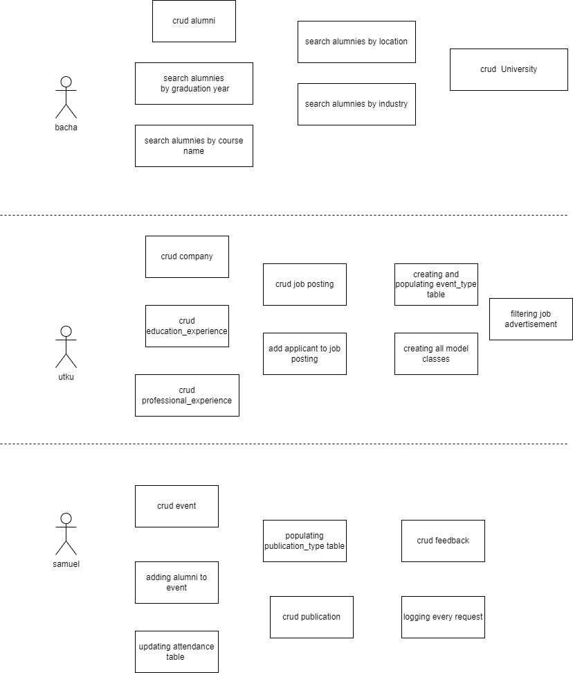

## Alumni Management Portal
 
The Alumni Management System is a comprehensive web-based application designed to efficiently organize and manage the interactions and data of a university or educational institution's alumni network. The primary goal of this project is to create a user-friendly platform that fosters stronger connections between alumni, facilitates networking opportunities, and enables seamless communication between alumni and the institution.

####  Key Features
--- 
* User Registration and Authentication
	* Alumni will be able to register on the platform using their mail addresses. The system will ensure secure authentication and authorization for accessing different features based on user roles.
* Alumni Profiles
	* Each registered alumni will have a personalized profile page where they can update their contact information, educational details, professional achievements, and profile picture.
*  Alumni Directory
	* The system will maintain a comprehensive directory of all registered alumni, searchable by graduation year, course, location, industry, and other relevant filters. This directory will enable alumni to find and connect with old classmates or professionals from their fields.
* Job Portal
	* The platform will include a dedicated job portal where alumni can post job openings in their organizations or explore job opportunities posted by other alumni. Job seekers can apply directly through the platform, enhancing the alumni community's job placement support.
* Events and Reunions
	* The system will facilitate event management, enabling alumni to organize reunions, professional networking events, workshops, and seminars. Alumni can RSVP for events, and event organizers can track attendance.
* News and Announcements
	* Administrators can publish news, updates, and announcements related to the institution, keeping the alumni community informed about the latest developments and achievements.
* Alumni Insights and Surveys
	* Conducting surveys and gathering feedback from alumni will be made easy through the platform. This valuable data can help the institution make improvements and tailor services to better meet the needs of alumni.
* Messaging
	* The users can communicate with one another and can have group conversations as well.
* Admin Dashboard
	* Administrators have access to a comprehensive dashboard to manage user accounts, events, job postings, and overall system settings.
	
####  Functional  Requirements
---
* Faculty/Students can only edit their own profile information.
* Students can only edit their own job advertisements.
* -   Students and Faculty can filter job advertisements:
    -   by state
    -   by city
    -   by companyName.
 * Students can add their professional job experiences to their profile.
 * Admin can Activate/Deactivate students and faculty.
 * Admin can reset passwords.
 * All delete operations should be a soft deletion.
 * Log all user activities on the system.
 * Limit login attempts. If a user try to login with an invalid password more than 5 times, the system will lock the user and make it unable to login for 15 minutes.

#### Technical Details
---
* Use Java and Spring Boot framework for the backend project.
* Use n-tier software architecture model.
* Populate your database with dummy data using `data.sql`.
	* Prepare your dummy data for testing and presentation.
* If necessary, change isolation levels.
* If necessary, change Fetch mode.

#### Submission
---
* Submit a detailed project plan for your daily performance (day/task/time) and submit it with your code.
* Create a postman collection for your endpoints.
* Upload your code to Sakai.
* Once you finished your project, send a Pull Request. (Send only one Pull Request once you finish the assignment.)
* Project will be evaluated based on your code quality. It is possible that I will need to schedule meetings with some students about their source-code.

#### Important Notes
---
* You are not allowed to share codes with your classmates. If detected, you will get NC.
 
* Remember to respect the code honor submission policy. All written code must be original. Presenting something as one’s own work when it came from another source is plagiarism and is forbidden.
    
* Plagiarism is a very serious thing in all American academic institutions and is guarded against vigilantly by every professor.

#### Task Division
----

#### Notes
----
https://docs.google.com/document/d/16Ty0FzlVFkHHI_-WvXmfhPF04K_XxOth-sXajyRYD_8/edit

